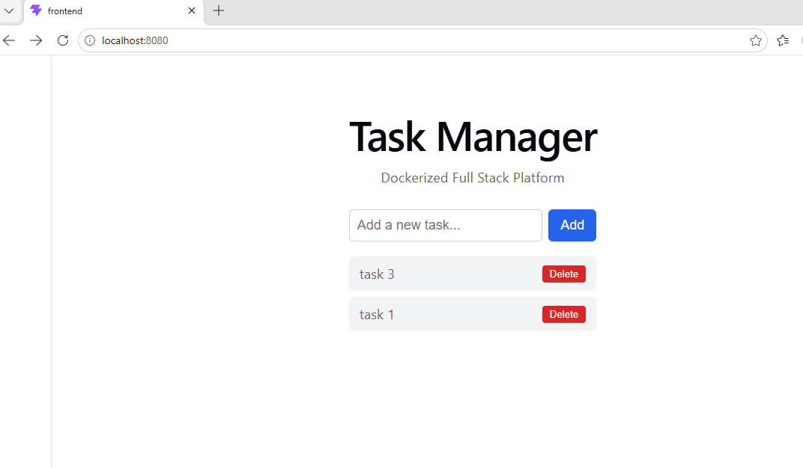

# Kubernetes Task Manager

A full-stack Task Manager application deployed to Kubernetes — taking the [dockerized-fullstack-platform](https://github.com/tevfikkoyun/dockerized-fullstack-platform) (React + Node.js/Express + PostgreSQL + Nginx) from Docker Compose to a complete set of Kubernetes manifests, applying every concept from the [kubernetes-mastery-labs](https://github.com/tevfikkoyun/kubernetes-mastery-labs) series.



## Architecture

```
                    Ingress (port 80)
                         │
          ┌──────────────┴──────────────┐
          │ /api/*                      │ /
          ▼                             ▼
    backend Service              frontend Service
    (ClusterIP :3000)            (ClusterIP :80)
          │                             │
    ┌─────┴─────┐               ┌───────┴───────┐
    │ backend   │               │   frontend    │
    │ Pod 1     │               │   Pod 1       │
    │ backend   │               │   frontend    │
    │ Pod 2     │               │   Pod 2       │
    └─────┬─────┘               └───────────────┘
          │ HPA (2-5 replicas)
          ▼
    postgres Service
    (ClusterIP :5432)
          │
    ┌─────┴─────┐
    │ postgres  │
    │   Pod     │
    └─────┬─────┘
          │
    PersistentVolumeClaim (1Gi)
    (data survives Pod restarts)
```

## What's in each manifest

### Database (`k8s/database/`)

| File | What it does |
|---|---|
| `secret.yaml` | PostgreSQL credentials as a K8s Secret (base64-encoded) |
| `pvc.yaml` | 1Gi PersistentVolumeClaim for database storage |
| `deployment.yaml` | PostgreSQL Deployment with PVC mount, resource limits, and `pg_isready` readiness probe |
| `service.yaml` | ClusterIP Service — only reachable from within the cluster |

### Backend (`k8s/backend/`)

| File | What it does |
|---|---|
| `configmap.yaml` | Non-sensitive config (DB_HOST, DB_PORT, DB_NAME, NODE_ENV) |
| `deployment.yaml` | Node.js/Express Deployment — 2 replicas, ConfigMap + Secret injection, liveness + readiness probes on `/health`, resource limits |
| `service.yaml` | ClusterIP Service on port 3000 |
| `hpa.yaml` | HPA: 2–5 replicas, scale on CPU >60%, 60s scale-down cooldown |

### Frontend (`k8s/frontend/`)

| File | What it does |
|---|---|
| `deployment.yaml` | React (static, served by Nginx) — 2 replicas, liveness + readiness probes, resource limits |
| `service.yaml` | ClusterIP Service on port 80 |

### Ingress (`k8s/ingress/`)

| File | What it does |
|---|---|
| `ingress.yaml` | Nginx Ingress: `/api/*` → backend, `/*` → frontend — single entry point, no port numbers |

## Kubernetes concepts applied

| Concept | Where used | Lab reference |
|---|---|---|
| Deployment + ReplicaSet | backend, frontend, postgres | Lab 03 |
| ClusterIP Service | all three services | Lab 04 |
| ConfigMap | backend non-sensitive config | Lab 05 |
| Secret | postgres credentials | Lab 05 |
| `envFrom: secretRef` | postgres (all keys at once) | Lab 05 |
| PersistentVolumeClaim | postgres data volume | Lab 07 |
| Ingress + path routing | `/api/*` vs `/*` | Lab 08 |
| Liveness Probe | backend `/health`, frontend `/` | Lab 09 |
| Readiness Probe | backend `/health`, postgres `pg_isready` | Lab 09 |
| Resource Limits + Requests | all containers | Lab 10 |
| HPA | backend (CPU-based, 2–5 replicas) | Lab 12 |

## Running locally

### Prerequisites
- Docker Desktop with Kubernetes enabled (or Minikube)
- Nginx Ingress Controller installed

Install Ingress Controller if needed:
```bash
kubectl apply -f https://raw.githubusercontent.com/kubernetes/ingress-nginx/controller-v1.12.0/deploy/static/provider/cloud/deploy.yaml
```

### Deploy

```bash
# Database
kubectl apply -f k8s/database/secret.yaml
kubectl apply -f k8s/database/pvc.yaml
kubectl apply -f k8s/database/deployment.yaml
kubectl apply -f k8s/database/service.yaml

# Backend
kubectl apply -f k8s/backend/configmap.yaml
kubectl apply -f k8s/backend/deployment.yaml
kubectl apply -f k8s/backend/service.yaml
kubectl apply -f k8s/backend/hpa.yaml

# Frontend
kubectl apply -f k8s/frontend/deployment.yaml
kubectl apply -f k8s/frontend/service.yaml

# Ingress
kubectl apply -f k8s/ingress/ingress.yaml
```

Or all at once:
```bash
kubectl apply -f k8s/database/ -f k8s/backend/ -f k8s/frontend/ -f k8s/ingress/
```

### Access

```bash
kubectl port-forward -n ingress-nginx service/ingress-nginx-controller 8080:80
```

Open `http://localhost:8080` in your browser.

### Verify

```bash
kubectl get pods          # all 5 Pods should be 1/1 Running
kubectl get pvc           # postgres-pvc should be Bound
kubectl get ingress       # taskmanager-ingress should have an ADDRESS
kubectl get hpa           # backend-hpa should show cpu metric
```

### Teardown

```bash
kubectl delete -f k8s/ingress/
kubectl delete -f k8s/frontend/
kubectl delete -f k8s/backend/
kubectl delete -f k8s/database/
```

## Design decisions

- **No application code in this repo.** Images are pulled directly from Docker Hub (`tevfikkoyun/fullstack-backend:latest`, `tevfikkoyun/fullstack-frontend:latest`) — built and pushed by the CI/CD pipeline in [dockerized-fullstack-platform](https://github.com/tevfikkoyun/dockerized-fullstack-platform). This repo contains only K8s manifests.
- **Backend uses both ConfigMap and Secret.** Non-sensitive values (DB_HOST, DB_PORT) go in ConfigMap; credentials (DB_USER, DB_PASSWORD) go in Secret — following the separation established in Lab 05.
- **Readiness probe on `/health` prevents traffic before database is ready.** Learned from the hanging-request bug in Docker Lab 12 — `/health` responds immediately without touching the database, while the main routes wait for `dbReady: true`.
- **postgres uses `pg_isready` exec probe instead of HTTP.** PostgreSQL doesn't serve HTTP — the `exec` probe type runs a command inside the container, which is the correct approach for non-HTTP services.
- **HPA minimum is 2, not 1.** A single backend Pod would be a single point of failure. Two replicas ensures availability even if one Pod is restarting or being replaced during a rolling update.
- **Ingress routes `/api/*` without rewriting the path.** The backend expects `/api/tasks` — stripping the prefix would require changes to the application code. Forwarding the full path keeps the manifest layer decoupled from the application layer.

## Related projects

- [dockerized-fullstack-platform](https://github.com/tevfikkoyun/dockerized-fullstack-platform) — the same application running on Docker Compose, with the CI/CD pipeline that builds and pushes the images used here
- [kubernetes-mastery-labs](https://github.com/tevfikkoyun/kubernetes-mastery-labs) — the 12-lab series where every concept in this project was first introduced
- [fullstack-aws-deployment](https://github.com/tevfikkoyun/fullstack-aws-deployment) — Terraform + Docker + AWS EC2 deployment of the same application